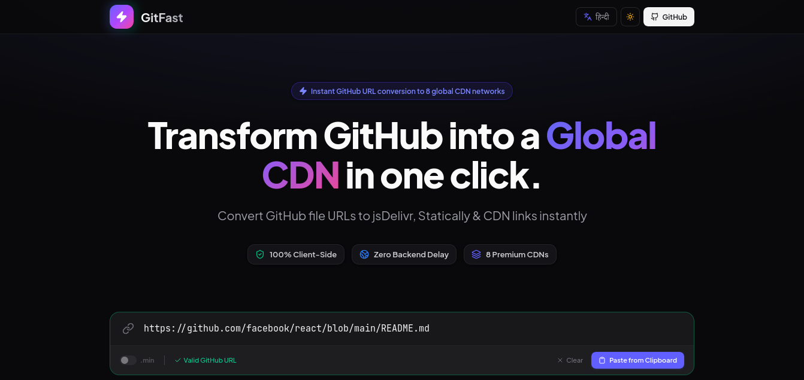

<div align="center">
  

  # ⚡ GitFast

  **The ultimate Client-Side GitHub URL to CDN Converter.**
  <br />
  Convert raw GitHub files to global CDN links (jsDelivr, Statically, GitHack) instantly.

  [](https://www.gnu.org/licenses/gpl-3.0)
  [](https://reactjs.org/)
  [](https://vitejs.dev/)
  [](https://tailwindcss.com/)

  [**Live Demo**](https://gitfast.acharyaml.com/)
</div>

---

## 🚀 Why GitFast?

GitHub is great for hosting code, but terrible for serving files directly to websites (due to strict `text/plain` MIME types and CORS restrictions). 
**GitFast** is a developer tool that automatically converts your raw GitHub file URLs into globally accelerated, production-ready CDN links.

### ✨ Key Features
- **🌐 8+ Global CDNs Supported**: Instantly generates links for jsDelivr, Statically, GitHack, GitHub Pages, and more.
- **🛡️ 100% Client-Side & Secure**: Zero backend tracking. No GitHub tokens required. Everything runs locally in your browser.
- **⚡ Auto-Minify & SRI Hash**: Automatically appends `.min` for JS/CSS files and generates Subresource Integrity (SRI) hashes for secure delivery.
- **📱 QR Code Generator**: Generates instant SVG/PNG QR codes for mobile testing.
- **📋 Embed Snippets**: Copy ready-to-use HTML `<script>`, `<link>`, or Markdown snippets directly into your projects.
- **🗃️ Developer Toolkit**: Easily purge jsDelivr cache, test CDN health status, edit branch paths, and export your converted CDN links to JSON/Markdown/TXT.
- **🌍 Bilingual Interface**: Fully supports English and Hindi (हिन्दी).

## 🛠️ Tech Stack
- **Frontend**: React 18, TypeScript, Vite
- **Styling**: Tailwind CSS (v3), Lucide React Icons
- **Features**: Browser-native WebCrypto API (for SRI hashing), QRCode.react

## 💻 Local Development

1. **Clone the repository**
   ```bash
   git clone https://github.com/gitfast/gitfast.git
   cd gitfast
   ```

2. **Install dependencies**
   ```bash
   npm install
   ```

3. **Run the development server**
   ```bash
   npm run dev
   ```

4. **Build for production**
   ```bash
   npm run build
   ```

## 🌍 Hosting on GitHub Pages (Free)
GitFast is a static React application, meaning it can be hosted completely for free on GitHub Pages.

1. Build the project: `npm run build`
2. Push the contents of the `dist/` directory to a `gh-pages` branch, or use GitHub Actions to deploy automatically.
3. Configure your custom domain (`gitfast.acharyaml.com`) in the repository settings and add a `CNAME` file.

## 📄 License
This project is licensed under the **GNU General Public License v3.0 (GPL-3.0)**.
You are free to use, modify, and distribute this software, but any derivative works must also be open-source and licensed under the GPL-3.0. See the `LICENSE` file for more details.

---
<div align="center">
  <i>Built with ❤️ for developers, by developers.</i>
</div>
